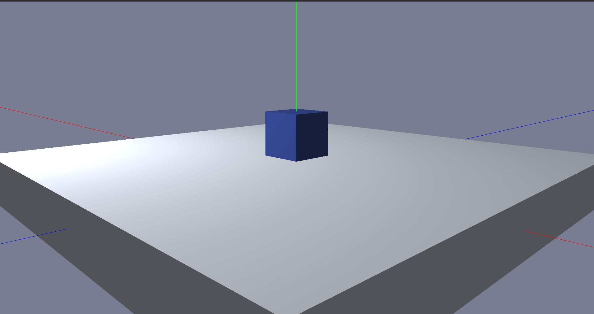
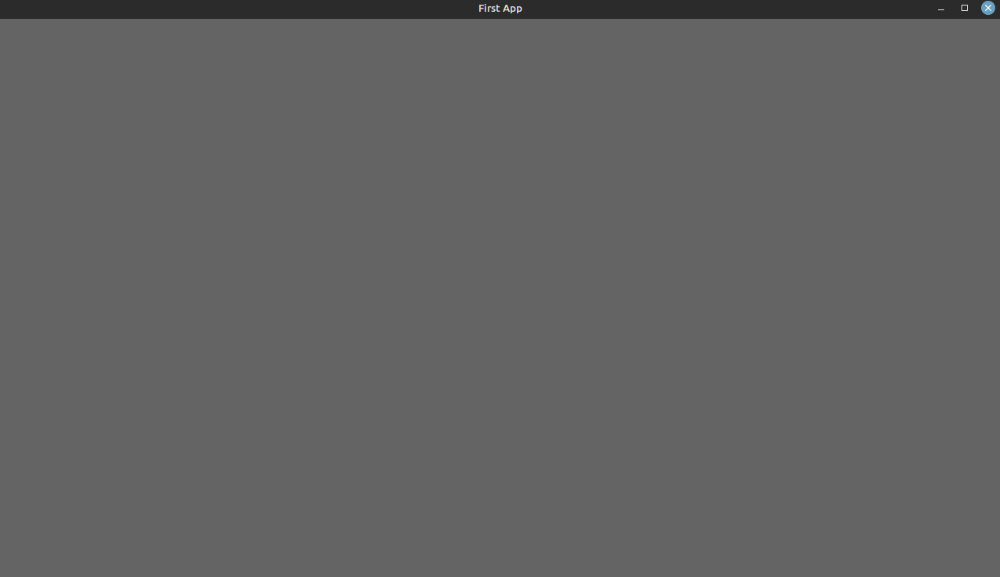
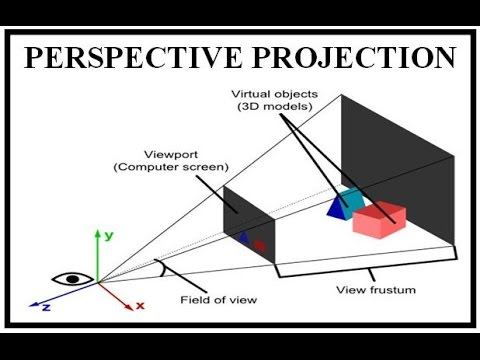

# JEngine

By Using java & OpenGL, I created a basic game engine. This engine has the standard basic functionalities to be a GameEngine. The engine provides several services like basic 2d objects, cube, lighting, camera view, window object, Time,  animation, load textures, transformations, basic physics and collision detection. Also, it has a MainController to control all of these components with each others. 



## Why Java ?

Java is one of the best & fastest programming languages. So, no wonder to use it in Game Development. By using LWJGL (OpenGL library in java) it made the management of GPU processing to the objects more flexible.

## Why Game Engine

So the question is why we should use the game engine if the OpenGL is better and faster? The answer is so simple. That's because the OpenGL hard to learn and hard to write code. The OpenGL uses built-in functions that tells the CPU what to do, and to write code from scratch is a waste of time. For this we use OOP to make it much easier. And OpenGL needs a strong understanding of Math and pyshics.

## Challenges

The hardest challenge I faced is that's the OpenGL is so hard to learn and the lack of good resources. during my shearching i found a book called Learn OpenGl- Grapics by joey de Vries. it's realy good and was clear.

## how to use & requirements

First of all, the project must run in vs code with these extensions:

1. project manager for java. 
2. java.

after that it needs to run the main method normally.

## Objects

### Window

Window objects is for creating instance of Window class. The window is what the user can see from rendering objects. So all objects we want to see are shown in this Window.

```java
Window(width, height, title)
```

#### Window methods

```java
window.add(GameObject); // to add an gameObject to window
window.addKeyListener(KeyListener); // Keylistener
window.addMouseListener(MouseListener); // MouseListener
window.addMouseMotionListener(MouseMotionListener);// MouseMovmentListener
window.cleanUp(); // to terminate and destroy the window 
window.getBackGroundColor(); // set backgroundColor
window.getRenderingObjects(); // list of shown objects in window
window.getHeight(); // return height of window
window.getWidth(); // return width of window
window.getTitle(); // return title of window
window.getWindow(); // return id of this window
window.isRunning(); // check whatever the window still running or not (true if not running)
window.pollEvent(); // check the evnets & rerender the window
window.setCursorHidden(); // set the cursor hidden (unshown)
window.disabledCursor(); // disabled the window
window.render() // to render the window
```

lets now try our first app

```java
import objects.Window;
import utils.Color;

public class FirstLook{
    static Window window;
    public static void main(String[] args) {
        window= new Window(1280, 720, "First App");
        window.setBackGroundColor(new Color(100,100,100));
        while(!window.isRunning()){
            window.render();
            // our code here
            window.pollEvent();
        }
    }
}
```
**RESULT:**

<div align='center'>
    
</div>

### View
The view object is a camera view. The camera is a window to let you view the global world and its objects. 

```java
view.render() // to let the camera works 
view.cameraPos() // the current position of the camera in XYZ 
view.isCameraIoMovement() // check whatever the camera in IO movement mode or not
view.setCameraIoMovement(boolean); // to set if the camera in IO mode or not. IO mode mean make the camera controlled by the mouse 
view.sensitivity; // vector2f for control the sensitivity of the mousein x and y axis 
view.mouseSpeed; // float varible to control the mouse speed

```
### Projection
The projection describes how the object will represent in the view. Also it's the ratio of the width and the hieght of the window.
<div align='center'>

</div>

```java
Projection((float)width/(float)height)
```

**Second App**
```java
import objects.Window;
import objects.View;
import objects.Projection;
import Engine.EngineController;
import objects.Rectangle;


import utils.Color;

public class SecondApp{
    static Window window;
    public static void main(String[] args) {
        window= new Window(1280, 720, "First App");
        window.setBackGroundColor(new Color(100,100,100));
        View camera =new View();
        Projection projection =  new Projection(720.f/800.f);
        Rectangle rect = new Rectangle();
        while(!window.isRunning()){
            window.render();
            EngineController.useDefualtProgram();
            
            rect.draw();

            camera.render();
            projection.sendMatrix();
            window.pollEvent();
        }

    }
}
```